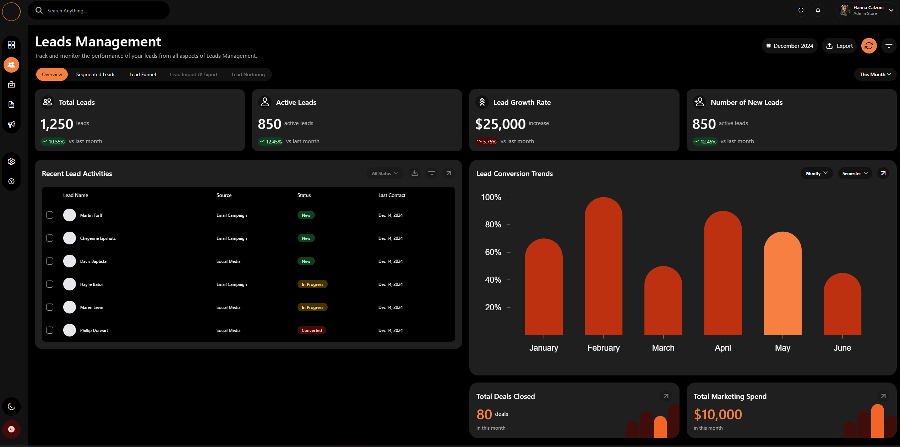

# Logistics Dashboard – Frontend



## Overview

Frontend logistics dashboard designed to visualize operational data through tables and charts, with multi-page navigation and a dedicated settings section.  
The project focuses on responsive design, UI consistency, and user experience, without relying on a real backend.

This application is built using **React Native and Expo**, deployed to the web via **React Native Web**, simulating a real-world product dashboard.

---

## Key Features

- Logistics-focused dashboard layout
- Data tables with individual detail pages
- Charts for data visualization
- Settings page
- Light / Dark theme support
- Fully responsive design (mobile, tablet, desktop)
- Clean and modern UI

---

## Tech Stack

### Core

- React 19
- React Native
- Expo
- Expo Router

### UI & Styling

- NativeWind (Tailwind CSS for React Native)
- @expo/vector-icons
- Expo Linear Gradient
- Expo Blur

### Navigation

- React Navigation
- Bottom Tabs Navigation

### Data Visualization

- Victory Native

### Platform & Deployment

- React Native Web
- Web deployment with Vercel

### Tooling

- TypeScript
- ESLint
- Prettier

---

## Responsive Design

The dashboard is optimized for multiple screen sizes:

- Mobile
- Tablet
- Desktop

A **mobile-first approach** was used, with adaptive layouts and scalable components to ensure consistent behavior across devices.

---

## Theming

The application supports:

- Light mode
- Dark mode

Theme selection is handled globally and remains consistent across all pages and layouts, providing a cohesive user experience in both GitHub light and dark environments.

---

## Demo

🔗 Live demo:  
https://dashboard-one-rose-14.vercel.app/dashboard/

---

## Project Focus

This project was developed to:

- Build a real-world dashboard layout using React Native
- Practice cross-platform frontend development (web + mobile)
- Design reusable UI components and layouts
- Implement navigation and theming at scale
- Deliver a polished frontend product without backend dependencies

---

## Installation & Local Setup

```bash
git clone https://github.com/your-username/dashboard.git
cd dashboard
npm install
npm run web
```
